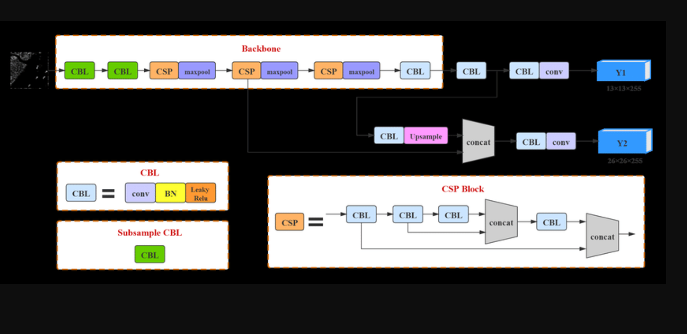

# yolo_human_orientation_detection

# The goal of this project is to create a bot that will sneak up on people who are not looking at or facing it. The core architecture is based strongly on YOLO v4 and thus relies on the CSPDarknet53 architecture as a feature extraction backbone. Resultingly, this also serves to convert that backbone to a keras/tensorflow- friendly interface as it was developed in pytorch.

Big thank you to Hunglc007's github repo who developed android versions of the same architecture
https://github.com/hunglc007/tensorflow-yolov4-tflite

